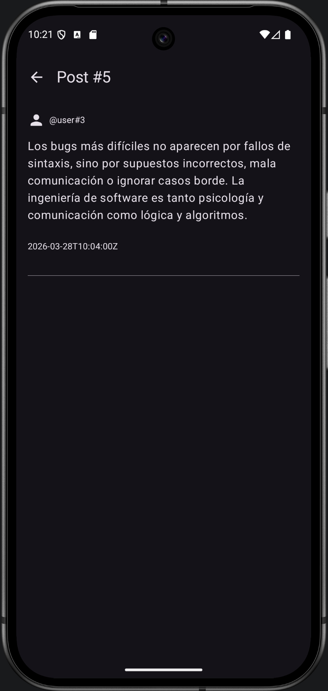
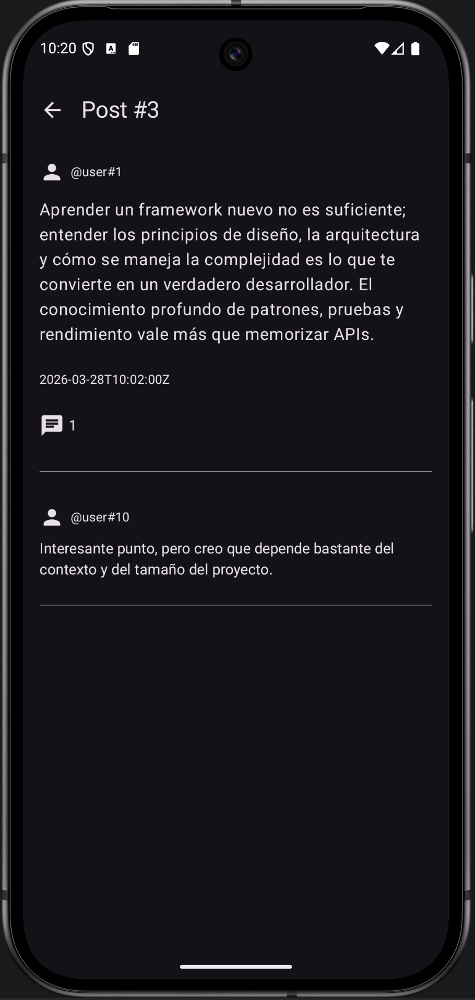
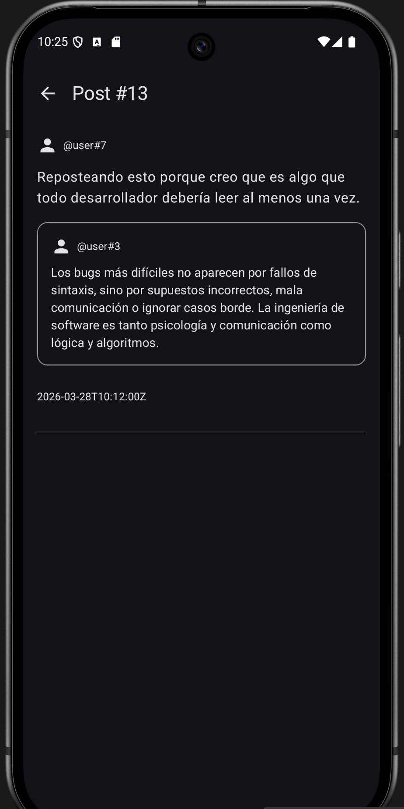

# Frontend 2

## Screenshots

Feed principal de publicaciones:


Fallback del feed principal de publicaciones:


Detalles de una publicación:



Si la publicación tiene respuestas, se muestran debajo:



Si la publicación es una republicación, se muestra como tal:



Perfil de usuario, con su información en la cabecera y un feed debajo con sus posts:


## (Original README)

This is a Kotlin Multiplatform project targeting Android, iOS, Web.

* [/composeApp](./composeApp/src) is for code that will be shared across your Compose Multiplatform applications.
  It contains several subfolders:
  - [commonMain](./composeApp/src/commonMain/kotlin) is for code that’s common for all targets.
  - Other folders are for Kotlin code that will be compiled for only the platform indicated in the folder name.
    For example, if you want to use Apple’s CoreCrypto for the iOS part of your Kotlin app,
    the [iosMain](./composeApp/src/iosMain/kotlin) folder would be the right place for such calls.
    Similarly, if you want to edit the Desktop (JVM) specific part, the [jvmMain](./composeApp/src/jvmMain/kotlin)
    folder is the appropriate location.

* [/iosApp](./iosApp/iosApp) contains iOS applications. Even if you’re sharing your UI with Compose Multiplatform,
  you need this entry point for your iOS app. This is also where you should add SwiftUI code for your project.

* [/shared](./shared/src) is for the code that will be shared between all targets in the project.
  The most important subfolder is [commonMain](./shared/src/commonMain/kotlin). If preferred, you
  can add code to the platform-specific folders here too.

* [/webApp](./webApp) contains web React application. It uses the Kotlin/JS library produced
  by the [shared](./shared) module.

### Build and Run Android Application

To build and run the development version of the Android app, use the run configuration from the run widget
in your IDE’s toolbar or build it directly from the terminal:
- on macOS/Linux
  ```shell
  ./gradlew :composeApp:assembleDebug
  ```
- on Windows
  ```shell
  .\gradlew.bat :composeApp:assembleDebug
  ```

### Build and Run Web Application

To build and run the development version of the web app, use the run configuration from the run widget
in your IDE’s toolbar or run it directly from the terminal:
1. Install [Node.js](https://nodejs.org/en/download) (which includes `npm`)
2. Build Kotlin/JS shared code:
   - on macOS/Linux
     ```shell
     ./gradlew :shared:jsBrowserDevelopmentLibraryDistribution
     ```
   - on Windows
     ```shell
     .\gradlew.bat :shared:jsBrowserDevelopmentLibraryDistribution
     ```
3. Build and run the web application
   ```shell
   npm install
   npm run start
   ```

### Build and Run iOS Application

To build and run the development version of the iOS app, use the run configuration from the run widget
in your IDE’s toolbar or open the [/iosApp](./iosApp) directory in Xcode and run it from there.

---

Learn more about [Kotlin Multiplatform](https://www.jetbrains.com/help/kotlin-multiplatform-dev/get-started.html)…
