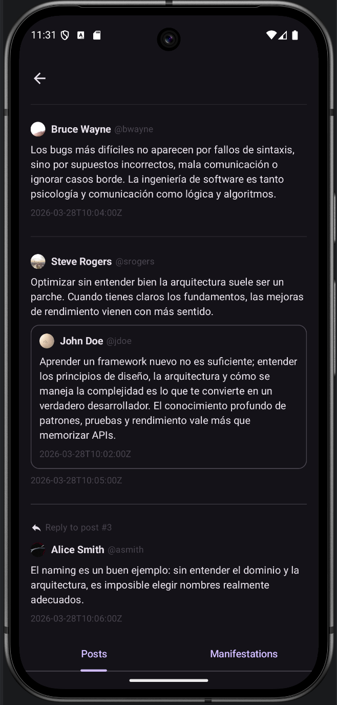
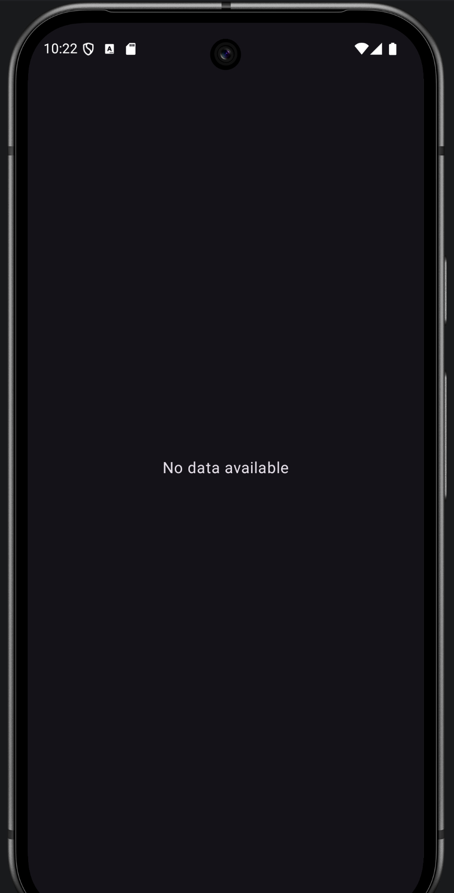
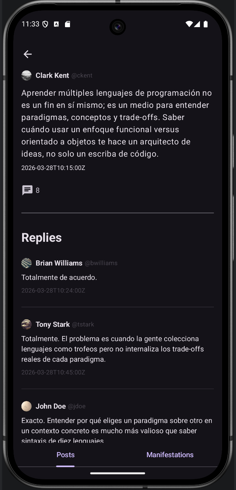
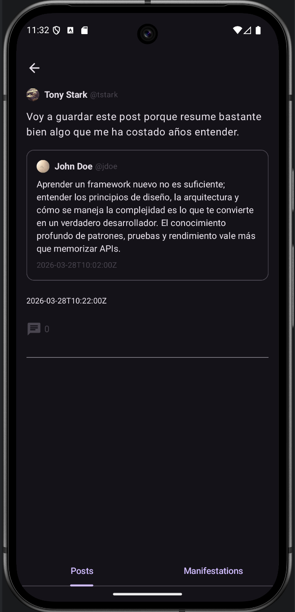
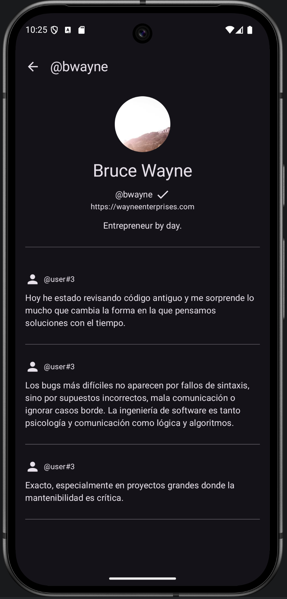

# Frontend 2

## Screenshots

### Feed principal de publicaciones

La colección de publicaciones recomendadas al usuario activo se muestra mediante una columna scrolleable en la que cada publicación se enmarca en un PostFrame.

Dentro de cada PostFrame, si la publicación es una respuesta a otra publicación, sobre la cabecera se muestra un icono de respuesta junto con un mensaje informativo.
Si clicamos en el icono o en el mensaje, nos dirige a la vista de detalle de la publicación a la que ésta responde.

Debajo del icono de respuesta, se muestra la cabecera de cada publicación con el nombre visible, el username y la foto de perfil de su autor.
Si clicamos en ella, nos dirige al perfil de ese usuario.

Debajo de la cabecera, se muestra el contenido de la publicación.
Si clicamos en él, nos dirige a los detalles de esa publicación.

Si es una cita de otra publicación, esta última se muestra embebida dentro, enmarcada.
De la publicación original sólo se muestra la cabecera con los datos de usuario de su autor.
Si clicamos en la publicación embebida, nos dirige a ella, y si clicamos en su cabecera, al perfil de usuario de su autor.

Debajo del contenido, se muestra un icono con el número de respuestas a esa publicación sólo si tiene alguna respuesta.

Debajo del contenido y el icono del número de respuestas, se muestra la fecha de creación de la publicación.



Fallback del feed principal de publicaciones:



### Detalles de una publicación

La vista de detalle de publicación es similar en muchos aspectos a la de los PostFrame del feed de publicaciones.
El contenido de la publicación se muestra en una fuente más grande, y se muestran aquí algunos detalles adicionales que no aparecen en el feed.

El icono de respuestas aparecerá aunque las respuestas sean 0.
En tal caso, el icono se verá sombreado.

Debajo de la publicación detallada, se muestra una columna de PostFrames con todas las respuestas a esa publicación, en caso de que ésta las tenga.



Si la publicación es una cita, se muestra embebida como tal, igual que en el feed:



### Perfil de usuario

Se muestra una cabecera con su foto de perfil, su nombre visible, su username, su página web y su bio.
Si el usuario está verificado, se muestra un check de verificación junto a su nombre visible.

Debajo de la cabecera, se muestra una columna de PostFrames igual que la del feed, sólo que aquí sólo se muestran las publicaciones y republicaciones realizadas por este usuario.



## (Original README)

This is a Kotlin Multiplatform project targeting Android, iOS, Web.

* [/composeApp](./composeApp/src) is for code that will be shared across your Compose Multiplatform applications.
  It contains several subfolders:
  - [commonMain](./composeApp/src/commonMain/kotlin) is for code that’s common for all targets.
  - Other folders are for Kotlin code that will be compiled for only the platform indicated in the folder name.
    For example, if you want to use Apple’s CoreCrypto for the iOS part of your Kotlin app,
    the [iosMain](./composeApp/src/iosMain/kotlin) folder would be the right place for such calls.
    Similarly, if you want to edit the Desktop (JVM) specific part, the [jvmMain](./composeApp/src/jvmMain/kotlin)
    folder is the appropriate location.

* [/iosApp](./iosApp/iosApp) contains iOS applications. Even if you’re sharing your UI with Compose Multiplatform,
  you need this entry point for your iOS app. This is also where you should add SwiftUI code for your project.

* [/shared](./shared/src) is for the code that will be shared between all targets in the project.
  The most important subfolder is [commonMain](./shared/src/commonMain/kotlin). If preferred, you
  can add code to the platform-specific folders here too.

* [/webApp](./webApp) contains web React application. It uses the Kotlin/JS library produced
  by the [shared](./shared) module.

### Build and Run Android Application

To build and run the development version of the Android app, use the run configuration from the run widget
in your IDE’s toolbar or build it directly from the terminal:
- on macOS/Linux
  ```shell
  ./gradlew :composeApp:assembleDebug
  ```
- on Windows
  ```shell
  .\gradlew.bat :composeApp:assembleDebug
  ```

### Build and Run Web Application

To build and run the development version of the web app, use the run configuration from the run widget
in your IDE’s toolbar or run it directly from the terminal:
1. Install [Node.js](https://nodejs.org/en/download) (which includes `npm`)
2. Build Kotlin/JS shared code:
   - on macOS/Linux
     ```shell
     ./gradlew :shared:jsBrowserDevelopmentLibraryDistribution
     ```
   - on Windows
     ```shell
     .\gradlew.bat :shared:jsBrowserDevelopmentLibraryDistribution
     ```
3. Build and run the web application
   ```shell
   npm install
   npm run start
   ```

### Build and Run iOS Application

To build and run the development version of the iOS app, use the run configuration from the run widget
in your IDE’s toolbar or open the [/iosApp](./iosApp) directory in Xcode and run it from there.

---

Learn more about [Kotlin Multiplatform](https://www.jetbrains.com/help/kotlin-multiplatform-dev/get-started.html)…
